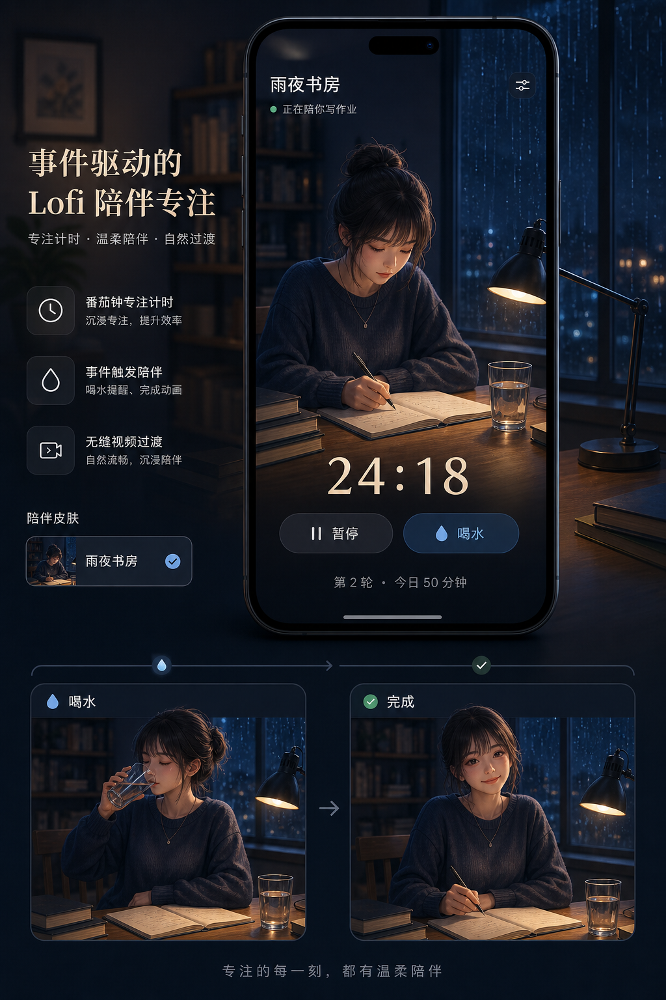
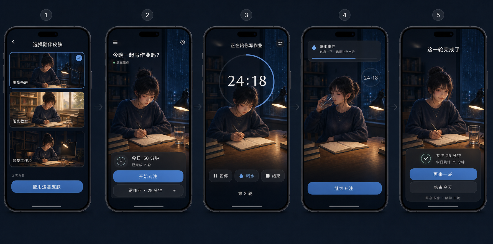
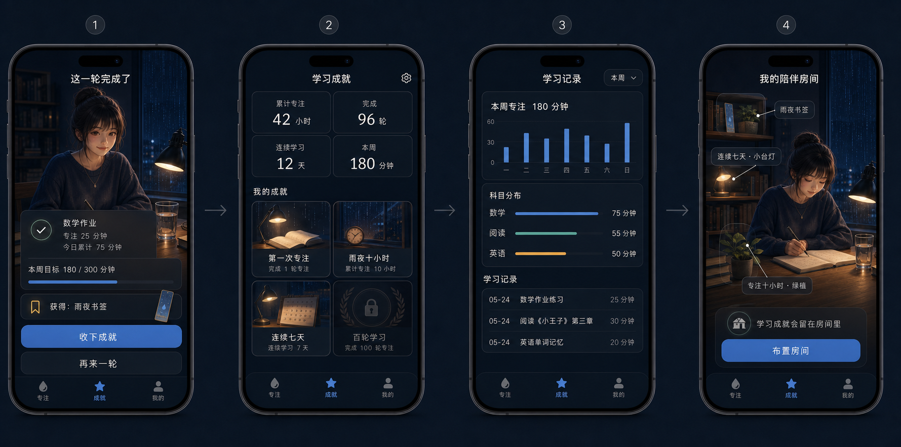
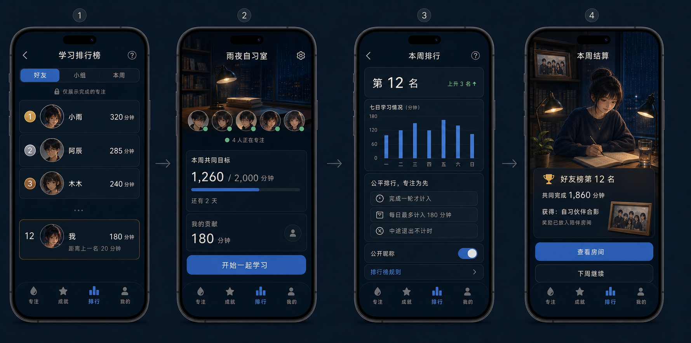

# 交互与视觉原型

版本：0.1

## 1. 原型范围

当前原型用于验证产品结构和情绪方向，不等于最终逐像素 UI。正式实现必须使用
MobileStarter 设计令牌、SVG 图标、无障碍标签和真实状态组件。

实现不得仅凭截图目测。精确令牌见 [视觉设计系统](07-VISUAL-DESIGN-SYSTEM.md)，
页面几何和交互见 [逐屏界面规格](08-SCREEN-SPECIFICATIONS.md)，截图对比与放行规则见
[视觉验收](09-VISUAL-ACCEPTANCE.md)。原型决定构图、氛围和视觉重心；规格文档决定
文字、尺寸、行为与状态。两者冲突时按视觉验收文件中的优先级处理。

## 2. 核心体验概念

验证问题：用户是否能一眼理解“角色在同一房间持续写作业，并会响应喝水和完成事件”。

## 3. 五屏核心旅程

1. 皮肤广场：免费皮肤明确可选，不先要求付费。
2. 今日首页：当前角色、今日进度和“开始专注”构成唯一主任务。
3. 专注页：视频是主视觉，计时与控制可读但不过度抢眼。
4. 事件态：喝水是短暂动作状态，不弹出阻塞式对话框。
5. 完成页：真实分钟、今日累计和下一步动作清楚可见。

## 4. 学习成就

成就分三层：

- 单轮反馈：本次完成了什么。
- 长期记录：累计时长、轮次、连续性和科目趋势。
- 房间沉淀：书签、小台灯、绿植等物品永久留在当前皮肤中。

## 5. 排行榜与小组

排行榜采用低压力设计：好友/小组范围、周结算、透明计分规则和可退出隐私设置。
小组挑战强调共同目标；排行榜奖励是房间纪念物，不是可购买的分数增益。

## 6. 导航原型

P0 底部导航：

| Tab | 内容 | 未登录可用 |
|---|---|---|
| 专注 | 当前房间、创建/恢复会话 | 是 |
| 成就 | 学习记录、成就、房间收藏 | 本地记录可用 |
| 排行 | 好友榜、自习小组、规则 | 否 |
| 我的 | 皮肤、购买、设置和账号 | 部分 |

皮肤广场从专注首页的皮肤入口和“我的”进入，不单独占用底部 Tab。

## 7. 关键状态

每个页面按需覆盖 `idle/loading/success/empty/error/offline/unauthorized`。

- 视频缓冲：保持海报图和计时，不显示全屏阻塞加载。
- 视频失败：回退同状态静态图，并提供非阻塞重试。
- 离线：免费/已下载皮肤正常播放；排行榜显示最后同步时间。
- 生成中：允许离开任务页，完成后通过站内通知返回。
- 购买处理中：禁止重复点击，使用订单查询恢复终态。
- 减少动态：事件只更换静态状态图，计时和成就逻辑不变。

## 8. 设计交付门禁

- 角色、服装、镜头、灯光和关键物品在同一皮肤的所有状态一致。
- 事件动作从基础姿势开始并回到可衔接的基础姿势。
- 视频默认静音；环境音轨独立循环，动作音效单独叠加。
- 触控目标至少 44×44；所有图标使用 SVG 并有语义标签。
- 专注页 5 秒后弱化 UI；减少动态和读屏模式下不隐藏必要操作。
- 关键中文文案进入本地化资源，不以生成图中文字作为真实 UI。
