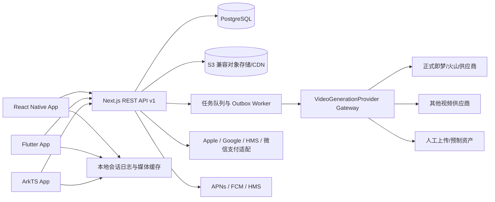
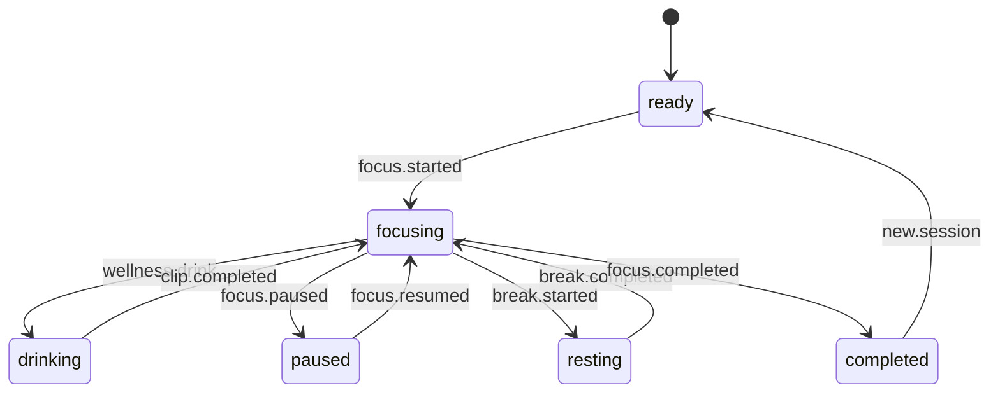

# 技术架构原型

版本：0.1

## 1. 架构目标

- 计时和已下载皮肤 local-first；服务端做最终校验与跨设备同步。
- 业务领域不依赖某个视频生成供应商。
- 生成、购买、成就和排行榜全部幂等且可审计。
- 视频失败不影响计时；生成服务不可用不影响免费核心体验。
- React Native 先形成金标准，Flutter/ArkTS 共享契约和状态语义。

## 2. 系统总览



## 3. MobileStarter 复用边界

直接复用：

- 启动编排、远程配置、认证、会话轮换和租户隔离。
- 用户资料、设备、通知、设置、客服、隐私和遥测。
- 动态会员、订单、商店支付校验、Webhook 去重和恢复购买。
- PostgreSQL、对象存储适配、管理控制面和统一错误模型。

新增业务域：

- `focus`：会话、暂停区间、本地事件日志和服务端结算。
- `skins`：皮肤、版本、状态资产、音轨、收藏和下载清单。
- `companion_runtime`：事件映射、优先级、冷却与播放器状态机。
- `achievements`：规则版本、发放账本和房间收藏物。
- `leaderboards`：好友关系、小组、有效分数和周快照。
- `generation`：报价、任务、供应商适配、审核和资产入库。
- `credits`：仅用于可消耗的 AI 定制生成，不参与学习成长。

## 4. 客户端分层

```text
presentation
  screens / components / navigation
application
  StartFocus / TriggerCompanionEvent / CompleteFocus / PurchaseSkin
domain
  FocusSession / CompanionStateMachine / AchievementRule / Entitlement
infrastructure
  SQLite / HTTP / SecureStore / Video / Audio / Notifications / Billing
```

页面不能直接请求供应商、写数据库、结算成就或判断购买权益。

## 5. 专注计时模型

- 开始时保存 `startedAtUtc`、单调时钟基准和客户端事件 ID。
- 暂停/继续写入不可变区间；显示时间由时间戳推导。
- 强杀恢复读取本地活动会话和区间，不依赖丢失的内存定时器。
- 服务端检查并发活动会话、区间重叠、异常跨度和设备时钟偏差。
- 完成请求使用幂等键；结算后会话、成就、排行榜增量和 outbox 在同一事务写入。

## 6. 陪伴播放器状态机



每个状态解析为 `poster + baseLoop[] + entry/action/exit + audio`。播放器先检查本地
缓存，再获取 CDN；任何动作缺失都回退皮肤默认动作。事件队列保存优先级、过期时间、
冷却键和返回状态，随机环境动作永远不能打断用户主动事件。

## 7. 媒体生产与分发

```text
皮肤模板
  → 静态角色/场景参考图
  → 人工确认一致性
  → 生成多个状态视频
  → 自动转码与首尾帧检查
  → 内容审核与人工抽检
  → 生成版本化 manifest
  → 发布到对象存储/CDN
  → 客户端按网络策略预下载
```

客户端不持有供应商密钥。供应商输出必须复制到自有对象存储，不能长期依赖临时 URL。
正式发布前需要确认供应商商业授权、地域、成本、内容政策和 SLA。

## 8. 生成任务与积分事务

创建定制任务的同一数据库事务：

1. 验证用户、报价版本、权益和内容参数。
2. 锁定 credit account。
3. 冻结本次所需生成额度。
4. 创建 generation task、reservation 和不可变账本记录。
5. 写入 outbox event 后提交。

外部生成只在事务提交后执行。成功时 capture；确定失败时 release；供应商状态不明时进入
`reconciling`，不能先退款再接受迟到的成功结果。

## 9. 成就与排行榜一致性

- `AchievementGrant(sessionId, ruleVersion)` 唯一，防重复发放。
- `LeaderboardScore(userId, weekId, scoreRuleVersion)` 使用原子增量。
- 周榜从有效会话账本计算，可随时重建，不相信客户端上传的总分钟。
- 好友/小组授权在查询层执行；任务正文不进入排行榜表和缓存。
- 周结算生成不可变快照；延迟同步的会话按公开规则决定是否补计。

## 10. 可靠性与降级

| 故障 | 用户体验 |
|---|---|
| 无网 | 本地计时、已下载皮肤和历史可用，稍后同步 |
| CDN 失败 | 海报图/基础皮肤降级，不中断计时 |
| 生成供应商失败 | 任务保留、自动重试或释放额度 |
| 支付回调延迟 | 显示处理中，通过订单查询恢复 |
| 排行榜不可用 | 显示最后快照，不影响专注和成就 |
| 推送不可用 | 站内通知保留，核心结果可在 App 内查询 |

## 11. 安全与可观测性

- Trace ID 贯穿客户端、API、队列、供应商任务和订单。
- 日志禁止记录 token、Cookie、任务正文、完整生成提示词和支付凭证。
- 供应商密钥只在服务端 secret store，按环境隔离并支持轮换。
- 对象存储默认私有；购买/定制资产使用短时签名 URL 或授权 CDN。
- 记录 API P95、播放失败率、缓存命中率、生成成功率、任务耗时、退款和账本差异。

