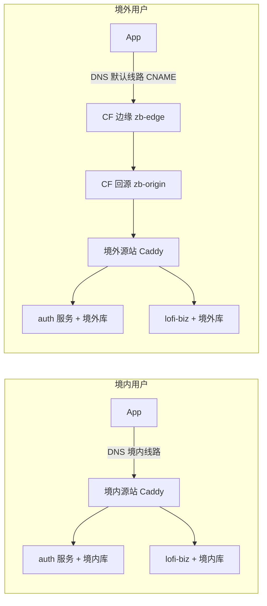

# 10 - Geo 分流与全球基础设施

版本：1.0（2026-09-10 落地）

## 1. 概述

Lofi Companion 的线上服务按"境内 / 境外"两条完全独立的链路运行：

- **境内用户**：DNS 分线路直连境内源站（腾讯云），全程不经过 Cloudflare。
- **境外用户**：DNS 解析到 Cloudflare 边缘（藏源站、抗 DDoS、边缘 TLS、就近接入），由 CF 回源到境外源站（Oracle 云）。
- **两套数据完全独立**：账号、专注记录、订单、自习室互不可见。这是有意的合规与产品边界（境内数据不出境），不是缺陷。

同一份 app 二进制、同一个域名，靠 DNS 分线路自动落位，**客户端无需感知区域**。

## 2. 全局拓扑



要点：

- Caddy 在源站按 **Host 头**分流（`auth.*`/`app.*` → auth 容器，`*.biz.*` → biz 容器），所以 CF 回源只需一个入口主机名。
- CF 回源时 SNI 是回源主机名（zb-origin），但 **Host 头保留原始域名**，源站据此分流。

## 3. 域名与 DNS 规划（DNSPod 托管 zhongbei.tech）

| 域名 | 境内线路 | 默认（境外）线路 | 用途 |
|---|---|---|---|
| `auth.zhongbei.tech` | A → 境内源站 | CNAME → `zb-edge.0x2a.top` | 认证/配置/会员（客户端 `EXPO_PUBLIC_API_URL`） |
| `app.zhongbei.tech` | A → 境内源站 | CNAME → `zb-edge.0x2a.top` | auth 的别名（等价入口） |
| `*.biz.zhongbei.tech` | A → 境内源站 | CNAME → `zb-edge.0x2a.top` | biz 通配符；`lofi.biz.zhongbei.tech` 是 biz 客户端端点（`EXPO_PUBLIC_BIZ_API_URL`） |

规则：

- **新增境外服务零 DNS 操作**：名字取 `X.biz.zhongbei.tech` 即被通配符覆盖；只需源站 Caddy 加站点 + CF 注册自定义主机名。
- 精确主机名记录存在时通配符对其失效（RFC 语义），新增显式记录必须**境内/默认两条线都配**。
- 旧域名 `lofi-biz.zhongbei.tech`（v1.0.2 之前客户端使用）已退役，无解析。

## 4. Cloudflare for SaaS 边缘层

CF 的 TLS 证书只发给"自家 zone 里的主机名"或"注册过的自定义主机名"，因此必须用 SaaS（Custom Hostnames）机制让 CF 认识 `*.zhongbei.tech`。选型结论：

| 选项 | 结论 |
|---|---|
| zone 整体迁回 CF | ❌ 免费版无分线路，境内分流崩塌 |
| Workers / Tunnel / 直连 CF IP | ❌ 同样过不了证书墙 |
| 第三方边缘（CloudFront/Deno 等） | 可行但更重 |
| **CF for SaaS 挂在自有闲置 zone** | ✅ 采用 |

结构（0x2a.top zone 同时承载多个产品的 SaaS，互不干扰）：

| 主机名（0x2a.top） | 云状态 | 角色 |
|---|---|---|
| `zb-edge` | 🟠 橙云 | DNSPod 默认线路的 CNAME 目标（纯入口指针） |
| `zb-origin` | 🟠 橙云 | 三个自定义主机名的 **per-hostname custom origin**（CF 回源中转） |
| `corterm-origin` → `usa` | — | 既有产品的 zone Fallback Origin，**未做任何改动** |

关键机制：

- 2025-05 起 **per-hostname custom origin** 下放到免费档：注册自定义主机名时各自指定 origin，**不必动 zone 级 Fallback**——这就是能与既有 SaaS 共存的原因。
- 自定义主机名注册：证书验证方式选 **TXT**，两条 TXT（`_acme-challenge.*` 与 `_cf-custom-hostname.*`）放到权威 DNS（DNSPod）。
- ⚠️ custom origin 主机名**必须橙云**，灰云会被拒（"gray clouded DNS record"）。
- 配额：每 zone 免费 100 个自定义主机名。

## 5. TLS 证书策略

| 证书 | 签发方 | ACME 通道 |
|---|---|---|
| CF 边缘证书（auth/app/lofi.biz） | Cloudflare | SaaS TXT 验证（TXT 在 DNSPod） |
| 源站 `*.zhongbei.tech` 各站点 | Let's Encrypt（Caddy 自动续期） | **`dns tencentcloud`**（权威在 DNSPod） |
| 源站 `*.0x2a.top` 各站点（如 zb-origin） | Let's Encrypt | `dns cloudflare`（该 zone 仍托管在 CF） |

**铁律**：DNS-01 必须使用**权威 DNS 对应的 provider 插件**。zone 迁移后旧通道会静默失效——证书当前有效、续期一直失败，直到到期日才爆炸（本项目真实踩雷）。每次迁移 DNS 托管商后必须逐站点核对 Caddyfile 的 `tls` 块。

## 6. 双机房与数据边界

| | 境内源站 | 境外源站 |
|---|---|---|
| 容器 | zhongbei-auth、lofi-biz、postgres、caddy | 同左（postgres 为 postgres18） |
| 数据库 | 独立实例 | 独立实例（**与境内不互通**） |
| auth 配置 | Admin API 管理（版本审计） | 独立初始化，同套配置内容，独立版本链 |
| 皮肤目录数据 | 真源 | 从境内 pg_dump 灌入（skins / skin_products / skin_manifests） |
| 对象存储 | S3 兼容桶（北京区域） | 同一桶（⚠️ 跨境拉取慢，待迁 R2/本地镜像，见 §9） |

服务间凭据（internal client credentials、支付 provider、OAuth secret）两侧等值对齐；JWT 同一私钥（token 可互验），但 `AUTH_JWT_ISSUER` 必须与 biz 侧 `AUTH_BASE_URL` **逐字一致**（biz 按 issuer 字符串验签）。

## 7. 镜像发布流水线

| 服务 | 仓库 / Workflow | 镜像 |
|---|---|---|
| auth | MobileStarter → `server-publish.yml` | `ghcr.io/<owner>/zhongbei-auth:latest`（amd64+arm64） |
| biz | LofiCompanion → `biz-server-publish.yml` | `ghcr.io/<owner>/lofi-biz:latest` |
| caddy | MobileStarter → `caddy-multidns-publish.yml` | `ghcr.io/<owner>/caddy-multidns:latest`（内置 alidns/tencentcloud/cloudflare 模块） |

**更新 runbook**：

1. push 到 main（paths 命中即自动构建，也可 workflow_dispatch）
2. 两台源站各自：`docker compose pull && docker compose up -d --force-recreate`
3. 源站配置（Caddyfile / .env）变更注意 §9 的 bind mount 坑

biz 数据库迁移（新机器初始化或 schema 变更）：

```bash
docker run --rm --network <compose网络> -v ~/workspace/lofi-biz/prisma:/prisma \
  -w /prisma -e DATABASE_URL="..." node:22-alpine \
  sh -c "npx -y prisma@<锁定版本> migrate deploy"
```

必须锁定与 package-lock 一致的版本，禁止裸 `npx prisma`。

## 8. 运维手册

### 8.1 新服务上架（境外）checklist

1. 源站 Caddy 加站点块（DNS-01 自动签源站证书）
2. CF → Custom Hostnames → Create：填 `X.biz.zhongbei.tech`、TXT 验证、**Custom Origin = zb-origin**
3. TXT 验证记录贴到 DNSPod（主机记录**不带**主域名后缀）
4. 状态 Active 即生效（通配符已覆盖 DNS，无需改记录）
5. 验证：境外 `curl -sD - https://X.biz.zhongbei.tech/health | grep cf-ray`

### 8.2 付费皮肤发布后

发布动作只写境内库的目录表，**需同步境外**：`pg_dump` 三表（skins/skin_products/skin_manifests）→ 境外库恢复。

### 8.3 回滚

- DNS：境内线不变，默认线 CNAME 改回 A → 境外源站即可绕过 CF
- 镜像：ghcr 保留 `sha-*` tag，compose 改 image tag 回滚
- auth 配置：Admin API 有 revisions + rollback

## 9. 已知限制与待办

- 皮肤媒体仍存北京区域对象存储，境外下载跨境慢。CF 只代理 API，救不了跨境媒体。正解：媒体复制到境外（R2 出流量免费 / 源站本地盘 + Oracle 10TB 免费 egress），biz 存储层是 env 驱动的 S3 适配器，改四个 env 即可切换。
- 自习室/社交按区分库隔离，跨区用户互不可见（产品语义）。
- 顺带修复的历史雷：zone 迁移后源站证书续期静默失败（见 §5 铁律）。

## 10. 踩坑记录（通用教训）

1. **单文件 bind mount 的 inode 陷阱**：`sed -i` 会换 inode，容器内挂载的还是旧文件——宿主机改配置容器"看不见"，reload 无效。改完必须 `docker compose up -d --force-recreate`；或用 `cat new > old` 保 inode 写入。
2. **DNSPod TXT 主机记录勿带主域名后缀**：填全名会变成双层 FQDN（`_x.example.com.example.com`），权威查不到。排查手段：`dig @<权威NS> <名字> TXT` 直查权威，绕过解析器缓存。
3. **CF SaaS 创建主机名的预校验**：要求主机名已 CNAME 进 zone 或存在预验证 TXT。dashboard 路径下先切 DNS 再创建；或用 TXT 预验证做零中断。
4. **issuer 一致性**：多区域部署时，auth 的 `AUTH_JWT_ISSUER` 必须与 biz 的 `AUTH_BASE_URL` 逐字一致，否则 biz 验签全部 UNAUTHORIZED（错误信息只有"缺少有效访问令牌"，不指向 issuer）。
5. **数据库角色验证假阳性**：容器内 psql 走 unix socket/peer 认证时，任何密码都能连上。验证凭据必须走网络路径（另一容器 `-h` 连接）。
6. **trust vs scram**：`docker exec` 进 postgres 容器的 TCP 测试也可能命中 trust 规则，同样假阳性。以"跨容器走 compose 网络"的连接为准。

## 11. 验证基线

```bash
# 境外：应出现 cf-ray 头（走 CF）且业务数据正常
curl -sD - https://auth.zhongbei.tech/api/health | grep -i cf-ray
curl -s https://lofi.biz.zhongbei.tech/api/v1/store/skin-products -H "x-app-id: loficompanion"

# 境内：应 200 且 remote_ip 为境内源站、响应无 cf-ray
curl -s -o /dev/null -w "%{http_code} (%{remote_ip})\n" https://auth.zhongbei.tech/api/health

# DNS 双视角
dig +short auth.zhongbei.tech @223.5.5.5    # 境内视角
dig +short auth.zhongbei.tech @1.1.1.1      # 境外视角
```
